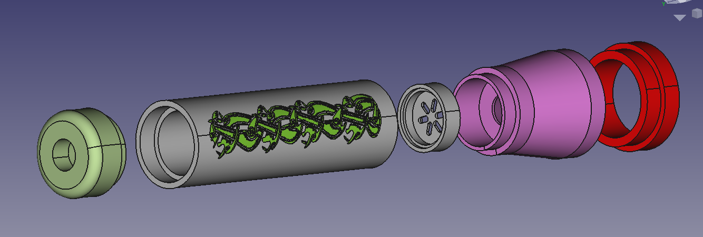

## FreeCAD Flashlight

This is a repository for a open source flashlight.  
It measures `Ø54mm x 223.5mm` depending on the batteries used.  

#### Prerequisites
* A normal lathe and a drill press OR a milling machine.
* Optional: A multi axis CNC is required for the fancy engraving.
* Round stock that has 60mm diameter and 340mm length.
* Material: 6061 aluminium alloy. 
* 2x 32600 lithium ion batteries Batteries (32mm diameter and 60mm length). the protected ones should fit.
  * Optional: It can easily be changed to use 32650 (32mm diameter and 65 mm length) if the 32600 batteries is impossible to get, just edit the `flashlight-32mm.FCStd` file using FreeCAD.
* It is also smart to use a good quality thermal paste on the backside of the LED PCB, and on the sides of the LED PCB holder. Something like NT-H1 from Noctua is good. Ordinary electric conductive copper paste or NT-H1 can perhaps be used on the sides on the part that holds the two PCB's to improve the thermal conductivity. The topside of the PCB board that has the LED must be electrically insulated with a 1mm thick PTFE spacer with a hole for the LED. **Important note:** it will short circuit against the flashlight head if this is not done.

You will need to thread the parts as you see fit, and add knurling.
The 3D files and blueprints doesn't have threads modelled or drawn.
Fine pitch threads is preferred.

If Anodizing is added as a surface treatment, the threads must be left bare, as the chassis is DC negative and electric connections must be preserved.

You just have to find the pad in the battery holder and add 10mm to it. That changes the total length of the tube that holds the batteries by +10mm.
You will need to export the iges files and the blueprints afterwards if that is done,as they will be out of date.
This also includes the fancy tube with engraving.

It should shine around 100 meters for two hours on full capacity and two 6000maH batteries.

If you are lazy, the IGES files and stl files for the fancy engraved version with two 32650 batteries is here:
https://www.dropbox.com/sh/6wbks64cn8wbjib/AAAcXH6BOxM2oGFneiy30rj1a?dl=0

Blueprints in PDF format,without the engraving for two 32650 batteries:
https://github.com/Supermagnum/Flashlight/tree/master/%C3%9832-32650B

Pictures of the engraving:  
  

STL file of the battery holder with fancy engraving:
https://www.dropbox.com/s/rnodmap73pcnvo5/viking-holder-negative.stl?dl=0

Picture:
https://github.com/Supermagnum/Flashlight/blob/master/%C3%9832-32650B/32650-n.png

Rendering of it from Blender, with anodized silver look:
https://raw.githubusercontent.com/Supermagnum/Flashlight/master/lommelykt.png

NOTE: Some of these cells mentioned is also available as LiFePO₄.
Use protected cells!

The blueprints for the part that holds the lens needs to be revised, basically a step that measures 42mm dia and 1.8 mm deep needs to be added. That holds the lens in place.
Alternatively, that could be added to the flashlight heads place for the reflector so that the lens fits in there.
Use liquid gasket on the lens holder threads, and cut a small thin disk from rubber (OD: 48mm ID:40mm 1~1.5mm thick)  that goes between the lens holder and the lens.

Note on the LED driver: The spring is positive polarity.
It doesn't have any protection agains reverse polarity, but its easy to add that.
It should be hold in place by a suitable snap ring, with holes. One of those holes can be used to solder in a ground wire for the polarity protection PCB.
Just use this PCB:
https://oshpark.com/shared_projects/WsPtYNPE

This PCB board is 31mm in diameter, it has a single P-Channel IRLR9343TRPBF mosfet that is capable of tolerating 20V 20A. It should be fairly simple to solder, even that it is surface mounted. It does not conduct any electricity if subjected to the wrong polarity. It has two 13mm solder pads,the one on the DC protected side can be soldered to the top of your existing drivers spring. There is also a DC- or ground connection, I suggest a AVG 15 (1.45 mm diameter ) flexible wire for this usage. The DC+ unprotected side goes to the batteries.

BOM: one P-Channel IRLR9343TRPBF MOSFET.

Github: https://github.com/Supermagnum/polarity

It's schematic diagram explains how it's wired up:
https://raw.githubusercontent.com/Supermagnum/polarity/master/schematic.png
It also requires a DC- negative connection, take care so the batterys DC+ side cannot get in contact with the PCB's DC- connection/solder pad.

One leg of the switch must be connected to the endcap. A small threaded bolt and a wire is good, the center prong of the switch needs to be extended so that it reaches above the bolt and wire. .
It's also some soldering involved, the legs on the switch,and the wires from the driver PCB is the ones that needs soldering.
That is four points total.

It also needs the parts, those are mentioned in the BOM file:
https://github.com/Supermagnum/Flashlight/blob/master/BOM.csv

Explanation on the files:
Exploded.jpg is the exploded view from Freecad, with all the parts visible.
Viking-holder.png is the battery holder with graphics from a sword hilt found at Alm in Stange, Norway. It's from around year 800.

`flashlight-32mm.FCStd`, this is the Freecad file without any fancy engraving.

FreeCAD can be found here:
https://www.freecadweb.org/
Its free!

The Freecad file for the battery holder with fancy engraving is here:
https://www.dropbox.com/s/gc08t12z3uo25pi/viking-holder.FCStd?dl=0

The iges file for that is in this link,because github cannot handle files of that size:
https://www.dropbox.com/sh/lizazcrzlvrs3z1/AABt5q_hpzIwJAGmto8MnXZPa?dl=0

All the IGES files and SVG blueprints are in their folders.

### Images

NOTE: The LED Driver and the LED PCB, and the O-rings and lithium ion batteries,lens,rubber disk and Noctua grease is not covered by the mentioned license!

The flashlight head might benefit from cooling grooves as it will get hot on 100% power!

If you are not happy with the design,fork it!
https://en.m.wikipedia.org/wiki/Fork_(software_development)

### License

After all, it's open source and licenced under: Creative Commons Attribution 4.0 International.

It's important that you make yourself familiar with it, please read here:
https://github.com/Supermagnum/Flashlight/blob/master/LICENSE

